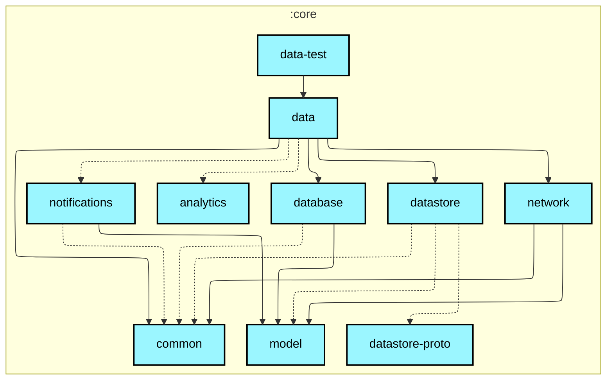
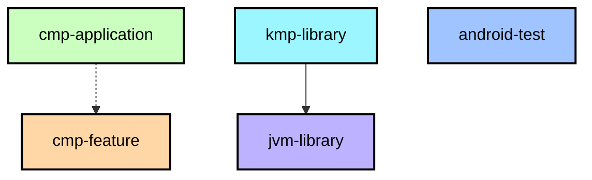

# `:core:data-test`

## Module dependency graph

<!--region graph-->

```mermaid
---
config:
  layout: elk
  elk:
    nodePlacementStrategy: SIMPLE
---
graph TB
  subgraph :core
    direction TB
    :core:analytics[analytics]:::kmp-library
    :core:common[common]:::kmp-library
    :core:data[data]:::kmp-library
    :core:data-test[data-test]:::kmp-library
    :core:database[database]:::kmp-library
    :core:datastore[datastore]:::kmp-library
    :core:datastore-proto[datastore-proto]:::kmp-library
    :core:model[model]:::kmp-library
    :core:network[network]:::kmp-library
    :core:notifications[notifications]:::kmp-library
  end

  :core:data -.-> :core:analytics
  :core:data --> :core:common
  :core:data --> :core:database
  :core:data --> :core:datastore
  :core:data --> :core:network
  :core:data -.-> :core:notifications
  :core:data-test --> :core:data
  :core:database -.-> :core:common
  :core:database --> :core:model
  :core:datastore -.-> :core:common
  :core:datastore -.-> :core:datastore-proto
  :core:datastore -.-> :core:model
  :core:network --> :core:common
  :core:network --> :core:model
  :core:notifications -.-> :core:common
  :core:notifications --> :core:model

classDef cmp-application fill:#CAFFBF,stroke:#000,stroke-width:2px,color:#000;
classDef cmp-feature fill:#FFD6A5,stroke:#000,stroke-width:2px,color:#000;
classDef kmp-library fill:#9BF6FF,stroke:#000,stroke-width:2px,color:#000;
classDef jvm-library fill:#BDB2FF,stroke:#000,stroke-width:2px,color:#000;
classDef android-test fill:#A0C4FF,stroke:#000,stroke-width:2px,color:#000;
classDef unknown fill:#FFADAD,stroke:#000,stroke-width:2px,color:#000;
```

Graph legend

```mermaid
graph TB
  cmp-application[cmp-application]:::cmp-application
  cmp-feature[cmp-feature]:::cmp-feature
  kmp-library[kmp-library]:::kmp-library
  jvm-library[jvm-library]:::jvm-library
  android-test[android-test]:::android-test

  cmp-application -.-> cmp-feature
  kmp-library --> jvm-library

classDef cmp-application fill:#CAFFBF,stroke:#000,stroke-width:2px,color:#000;
classDef cmp-feature fill:#FFD6A5,stroke:#000,stroke-width:2px,color:#000;
classDef kmp-library fill:#9BF6FF,stroke:#000,stroke-width:2px,color:#000;
classDef jvm-library fill:#BDB2FF,stroke:#000,stroke-width:2px,color:#000;
classDef android-test fill:#A0C4FF,stroke:#000,stroke-width:2px,color:#000;
classDef unknown fill:#FFADAD,stroke:#000,stroke-width:2px,color:#000;
```

<!--endregion-->
